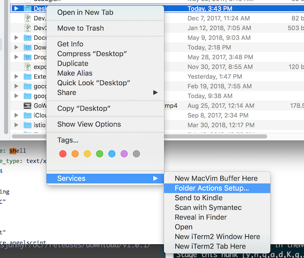

#  OCR

`ocr` uses GCP or AWS to extract text from images.

## Installation

### Homebrew Installation on OS X

```sh
$ brew tap andersjanmyr/tap
$ brew install ocr
```

### Other Installation

`ocr` is a single binary. Install it by right-clicking and `Save as...` or with
`curl`.

### Links

* [OS X](https://github.com/andersjanmyr/ocr/releases/download/v1.0.1/ocr-osx)
* [Linux](https://github.com/andersjanmyr/ocr/releases/download/v1.0.1/ocr-linux)
* [Windows](https://github.com/andersjanmyr/ocr/releases/download/v1.0.1/ocr.exe)

### Curl

```sh
# OS X
$ curl -L https://github.com/andersjanmyr/ocr/releases/download/v1.0.1/ocr-osx \
  > /usr/local/bin/ocr

# Linux
$ curl -L https://github.com/andersjanmyr/ocr/releases/download/v1.0.1/ocr-linux \
  > /usr/local/bin/ocr

# Make executable
$ chmod a+x /usr/local/bin/ocr
```

## Setup

* For Google, enable the vision API and billing and create a service account, https://cloud.google.com/vision/docs/libraries#client-libraries-install-go, then make sure that you set `GOOGLE_APPLICATION_CREDENTIALS` to the path to your new service account authentication file.
* For AWS, configure your credentials according to https://docs.aws.amazon.com/cli/latest/userguide/cli-chap-getting-started.html

## Usage

```sh
$ ocr <image file>
```

## Folder Watching

The following AppleScript can be used to listen for new files and copy the text
to the clipboard. It needs to be attached as a *Folder Action* to the directory
you want to listen to. Since my screenshots are saved to the Desktop, this is
where I have attached the script.



```applescript
-- ~/Library/Scripts/Folder Action Scripts/ocr.scpt
on adding folder items to theAttachedFolder after receiving theNewItems
  tell application "Finder"
    repeat with anItem in theNewItems
      set p to POSIX path of anItem
      set command to "GOOGLE_APPLICATION_CREDENTIALS=/path/to/auth.json /usr/local/bin/ocr " & (quoted form of p)
      try
	set output to do shell script command
	set the clipboard to output
      on error theError
	activate
	display dialog theError
      end try
    end repeat
  end tell
end adding folder items to
```
